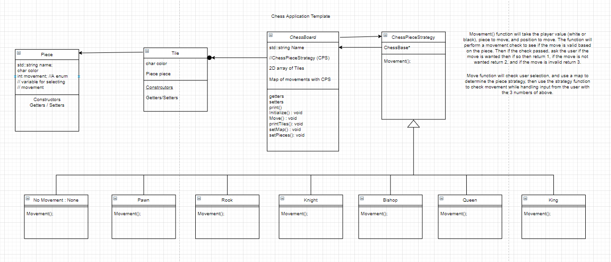

# Chess
A Github Repository for a text based chess game application

## Piece class
The `Piece` class will be the most basic component of the overall chess application. It will have three private variables, including the Pieces physical representation, the piece name, and a variable which is used to assign the Piece its related movement style. It will also have the constructors, getters, and setters in order to create a `Piece` Oobject and edit an existing `Piece` object. The `Tile` class will contain a `Piece` object which will be built upon by the `ChessBoard` class.

## Tile class
The `Tile` class will contain a `Piece` Object and a variable to hold the the representation of the Tile's color. The `Tile` class will also have constructors, getters, and setters in order to create a `Tile` object or to edit an existing one.

## ChessBoard class
The `ChessBoard` class will have a string variable for the board's name, a 8 X 8 board of `Tile` objects, a map using an enum object (also used for the Piece class) with Chess Piece Strategy objects for mapping out pieces with their movements, and a array of all the pieces which will be used on the board. A setMap function is used to assign each `ChessPieceStrategy` class object with its appropriate Enum name, which will be utilized by the move function for moving the pieces on the board. A setPieces function will initialize the Pieces array to have all the pieces the board will contain. The `ChessBoard` class will also have an initializeBoard function, used for the initial setup of a chess game, while also having to print functions for printing the pieces on the board and the colors of the tiles on the board. There is also a move function which will utilize the map and the `ChessPieceStrategy` classes in order to move pieces along the board. Finally, the `ChessBoard` class will also have constructors, getters, and setters in order to create `ChessBoard` objects or to edit existing ones.

## ChessPieceStrategy Classes
These classes use the Strategy Pattern with a base `ChessPieceStrategy` class which has the movement function which all of its children will utilize in different ways and a `ChessBoard` object so that the board of `Tile` objects can be accessed by its children. There will be Seven children classes to the `ChessPieceStrategy` class, including the `None`, `Pawn`, `Rook`, `Knight`, `Bishop`, `Queen`, and `King` classes.

## Basic Template for Class Structure

